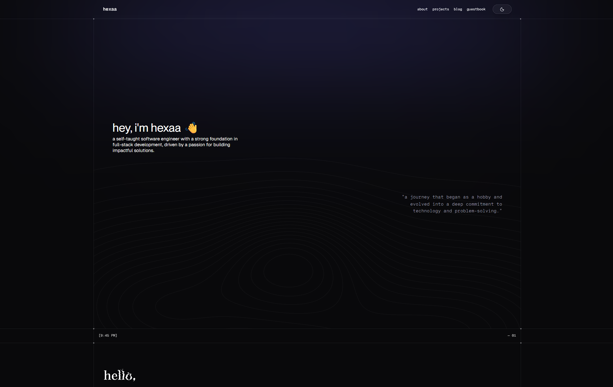

  <h1>personal-web / hexaa.sh</h1>
  
🔥 A personal website built from scratch using Next.js, TypeScript, Tailwind CSS, SWR, Drizzle, and Neon Postgres

 

  <a href="https://hexaa.sh" target="_blank">hexaa.sh</a>
  &nbsp;
  <a href="https://redesign.hexaa.sh" target="_blank">redesign.hexaa.sh (development)</a>

## Introduction

This is my third portfolio website, built from scratch using Next.js, Drizzle ORM, and other helpful tools.

Please note that this portfolio website is not 100% complete. It continues to evolve with improvements, bug fixes, visual enhancements, and more. This website is where I share what I've learned and offer insights to others.

Feel free to use this website as a reference, for inspiration, or as a template, following the provided license. You can access the source code to customize it to your needs.

If you find this website helpful, please consider leaving a rating. 😎👍🏻

## Special Thanks to

  <a href="https://siege.hackclub.com/?ref=432">
    </img>
  </a>
  &nbsp;&nbsp;&nbsp;&nbsp;&nbsp;
  <a href="https://hackclub.com">
    </img>
  </a>

